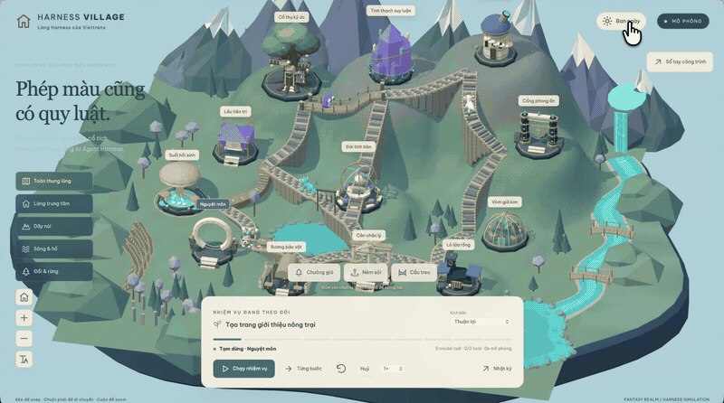

# Demo Media

Store public-facing demo images and animation previews here. Link them from the repository README using relative paths.

## Harness Village

A recorded 3D fantasy village with camera navigation and animated creatures. This is an existing project demonstration supplied by the author, created before the standalone skill was implemented; it is not a benchmark of the released skill.



- Source: author-supplied `Harness-3d-Village.mp4` (48.47 seconds, 3608 × 2160, 60 fps).
- GIF: source interval 00:24–00:32, 800 × 446, 12 fps, 128-color palette, infinite loop; no audio. The loop restarts with a camera cut.
- Crop: 3300 × 1840 at x=154, y=156, removing the surrounding desktop background.
- Static preview: frame at 00:40, 1440 × 803, JPEG.
- Original recording is kept outside the repository to avoid bundling the large source video.
- Provenance: converted from the supplied recording using FFmpeg; not an AI-generated mockup. The repository is MIT licensed, but this recording is **not** covered by that grant: its redistribution rights, and those of the assets it depicts, are still to be confirmed.
- The landing page plays transcoded copies of this GIF (`site/public/media/origin/harness-village.{webm,mp4}` plus a poster frame, 800 × 446, produced by `site/scripts/site-media.py --origin`), carrying the same provenance note; the redistribution caveat above applies to them unchanged. See [the landing page notes](../site.md).

### Embed in the repository README

```markdown
### Harness Village

An early 3D project showcasing the visual direction behind this skill.


[Static preview](docs/demos/harness-village-preview.jpg)
```

### Reproduce the GIF

Run from the repository root, replacing `/path/to/Harness-3d-Village.mp4` with the source recording:

```sh
ffmpeg -ss 24 -t 8 -i /path/to/Harness-3d-Village.mp4 \
  -filter_complex '[0:v]crop=3300:1840:154:156,fps=12,scale=800:-1:flags=lanczos,split[a][b];[a]palettegen=max_colors=128:stats_mode=diff[p];[b][p]paletteuse=dither=bayer:bayer_scale=3:diff_mode=rectangle' \
  -loop 0 docs/demos/harness-village.gif
```

## Skill showcase (2026-09)

Twenty-one runtime captures of what the skill's own kits, rigs and recipes draw, produced by
`python3 scripts/showcase.py` from [showcase.json](showcase/showcase.json) and logged in
[showcase-log.json](showcase/showcase-log.json). Provenance, the same discipline as Harness Village
above: every frame is a headless Chromium capture on this machine (Apple M4 Max,
Apple M4 Max, ANGLE Metal, `capture_mode: gpu` on all twenty-one), 1920x1080 JPEG q88, the app
chrome hidden with `?plate=1`, no retouching, no third-party asset. Village frames came from the
[retired pilot revision](../../evidence/artifacts/legacy-early-slice/README.md) at mixed tiers (T3 hero, T2 mid, T1
instanced background); harness frames use the blueprint proof harness (neutral grey studio, one sun,
no post-processing) at the tier named; the two breadth frames came from the archived
[breadth bench](../../evidence/artifacts/legacy-showcase-breadth/design-system.md), one Vite project built the way SKILL.md says.
Honest limits: T2 surfacing is stylized-game quality and T3 adds bevels and baked light but not
authored topology; a machine without Blender tops out at T2; the harness freezes animation, so the
walker frames are stills; the village frames carry four looks through the retired example's `?look=` switch (dusk-golden-hour, night-lantern, tilt-shift, overcast), each a lighting-and-lens reading of its record with the departures preserved in the [look table](../../evidence/artifacts/legacy-early-slice/village-look-table.js). A twentieth frame, the heart-cutaway schematic, was rendered and dropped by the maintainer as too plain to show; a current standalone heart study is listed in the [examples collection](../../examples/README.md).

| # | frame | what you see | look | tiers | size |
| --- | --- | --- | --- | --- | --- |
| 1 | [village-dusk-golden-hour](showcase/village-dusk-golden-hour.jpg) | Latent Village at dusk, the whole island from the home view. | knowledge.style-lantern-festival-riverside | hero T3, mid T2, background T1 | 189 KB |
| 2 | [village-night-lantern-river](showcase/village-night-lantern-river.jpg) | Latent Village at night: the lantern practicals are the only key light, blue darkness between the pools (`?look=night-lantern`). | knowledge.style-lantern-festival-riverside / knowledge.lighting-mood-night-lantern | hero T3, mid T2, background T1 | 132 KB |
| 3 | [village-tilt-shift-diorama](showcase/village-tilt-shift-diorama.jpg) | The island as a tabletop model: 22 degree lens and a depth-of-field band across inn and tower (`?look=tilt-shift`). | knowledge.style-tilt-shift-diorama | hero T3, mid T2, background T1 | 111 KB |
| 4 | [village-overcast-morning](showcase/village-overcast-morning.jpg) | The bridge under overcast light: no cast shadow, desaturated, objects grounded by the T2 bake alone (`?look=overcast`). | knowledge.lighting-mood-overcast-soft | hero T3, mid T2, background T1 | 412 KB |
| 5 | [watermill-wheel-turning](showcase/watermill-wheel-turning.jpg) | The watermill from the mill view, wheel mid-turn; T2 surface inside 9.5 m, the Blender-baked T3 hero beyond. | knowledge.style-lantern-festival-riverside | hero T3 | 330 KB |
| 6 | [stone-bridge-over-water](showcase/stone-bridge-over-water.jpg) | The bridge from the pond side: mill, glasshouse, market stall and lantern posts in one frame. | knowledge.style-lantern-festival-riverside | mid T2 | 440 KB |
| 7 | [village-layout-overview](showcase/village-layout-overview.jpg) | Top-down plan of the island; the lanes, plots and river read as a layout. | knowledge.style-lantern-festival-riverside | hero T3, mid T2, background T1 | 188 KB |
| 8 | [village-lantern-riverside-pond](showcase/village-lantern-riverside-pond.jpg) | The pond with its stone rim, lily pads, reeds and the fox on the lane. | knowledge.style-lantern-festival-riverside | mid T2, background T1 | 237 KB |
| 9 | [village-inn-doorway](showcase/village-inn-doorway.jpg) | Inn door, well and the white ox at the threshold; every surface here is tier T2. | knowledge.style-lantern-festival-riverside | mid T2 | 379 KB |
| 10 | [stone-guildhall-closeup](showcase/stone-guildhall-closeup.jpg) | Stone guildhall, a Blender-exported glTF asset at tier T2: coursed ashlar and tile courses applied to the loaded GLB (phase 10). | proof harness, neutral studio | hero T2 | 115 KB |
| 11 | [timber-cottage-t3-closeup](showcase/timber-cottage-t3-closeup.jpg) | Timber cottage at tier T3: bevelled arrises, baked occlusion under eaves and sills, one 2048 px atlas. | proof harness, neutral studio | hero T3 | 121 KB |
| 12 | [long-hall-porch-chimneys](showcase/long-hall-porch-chimneys.jpg) | Long hall at tier T2: tiled roof, two brick chimneys, porch and hanging sign. | proof harness, neutral studio | mid T2 | 220 KB |
| 13 | [round-tower-elevation](showcase/round-tower-elevation.jpg) | Round tower at tier T2: banded stone, lit window, arched door and timber stair. | proof harness, neutral studio | mid T2 | 65 KB |
| 14 | [market-stall-canopy](showcase/market-stall-canopy.jpg) | Market stall at tier T2: woven canopy stripes, crates, fruit and sacks. | proof harness, neutral studio | mid T2 | 87 KB |
| 15 | [iron-lantern-gltf-detail](showcase/iron-lantern-gltf-detail.jpg) | Iron lantern post, the second glTF asset, at tier T2: hammered iron and brass collars applied to the loaded GLB. | proof harness, neutral studio | prop T2 | 35 KB |
| 16 | [tree-round-canopy](showcase/tree-round-canopy.jpg) | Round tree at tier T2: bark grain on the trunk, foliage left flat on purpose. | proof harness, neutral studio | background T2 | 40 KB |
| 17 | [well-stone-collar](showcase/well-stone-collar.jpg) | Well at tier T2 after the UV fix: ashlar drum, tiled hood, rope and bucket. | proof harness, neutral studio | prop T2 | 133 KB |
| 18 | [quadruped-walker-stance](showcase/quadruped-walker-stance.jpg) | Quadruped walker at tier T2 with the fur family (short strands, tone patches) added in phase 10. | proof harness, neutral studio | hero T2 | 44 KB |
| 19 | [biped-walker-stance](showcase/biped-walker-stance.jpg) | Biped walker at tier T2: knitted sweater, twill trousers, mid-stride pose from the proof harness. | proof harness, neutral studio | hero T2 | 53 KB |
| 20 | [bloch-ball-linear-algebra](showcase/bloch-ball-linear-algebra.jpg) | Bloch sphere from the breadth bench: state vector, axes, angle annotations. | knowledge.style-technical-illustration | n/a (recipe, no kit) | 62 KB |
| 21 | [coupled-gears-studio](showcase/coupled-gears-studio.jpg) | Coupled gears in the dark studio look: 24 T / 16 T, module 10 mm, ratio 3:2. | knowledge.style-stylized-realism | n/a (recipe, no kit) | 89 KB |

For a new standalone-example capture run, provide a new manifest and output directory:
`python3 scripts/showcase.py --manifest <new-manifest.json> --out docs/demos/showcase/<new-run> --force --python <playwright-python>`
(strictly sequential, one browser, `--budget-s` default 1800, resumable). Historical gallery paths
are refused. The log's `sha256` per shot makes the diff reviewable.
