# Before / after: one prompt, with and without the skill (2026-09)

Five agents were given the same prompt. One had nothing. Four had `3dviz-pro-max` — at four
successive states of the skill. All five built a runnable village and inspected it themselves. This
folder holds the five projects, their capture sets, five checklist scorecards, and an honest reading
of what the skill changed — including where the run without it came out ahead, and the run that
shipped a village in which nothing moved.

**Short version.** Round 1 was not a win: the skill produced better-documented, better-instrumented
work and a scene that was frozen solid. Round 2, after the scaffold fix that failure forced, was the
first with-skill run to beat the baseline. Round 3, with the kit steps, was the first to pass the
detail ladder, while regressing the viewport fit and costing 7× run 2's draw calls at 5 fps; on the
current wording of item 9 it ties run 2 rather than leading it. Round 4, with the quality tiers,
scores highest of the five — by two items — and is **the only run in the evaluation to pass the
surface item**, with a Blender-baked T3 hero, the
viewport fit recovered and the most complete self-documentation of the five. It is also the most
expensive scene yet measured (**7,242 draw calls at 2.3 fps**, unmeasured by its own report) and it
ships three of seven named views damaged by camera placement, one of which it does not notice. Across
four with-skill runs the spread is 19 → 23 → 23 → 25 out of 30, against a baseline of 21. That is a
real direction of travel and a thin margin; at n=1 per condition it is not a demonstration that the
skill makes better scenes.

## Protocol

| | |
| --- | --- |
| Prompt | [`prompt.txt`](prompt.txt) — [`README.md`](../../../README.md) line 19, verbatim, byte-identical for all five runs |
| Model / host | the same Claude Opus model, Claude Code CLI on macOS (darwin 25.5.0, arm64); runs 1–3 and the baseline 2026-09-08, run 4 2026-09-09 |
| Isolation | five fresh subagents, no shared context, fresh temp directory each |
| Shared constraints | Vite + three 0.180.0, pnpm; one generation pass plus at most two self-fix iterations; no visual iteration beyond that; the agent inspects its own build before reporting |
| The only difference | the with-skill agents were additionally given the skill folder path and told to read `SKILL.md` first |
| Run 1 → 2 → 3 → 4 | identical prompt and constraints throughout. Run 2 came after the scaffold fix (first-frame `dt` clamp + `invalidate` wiring); run 3 came after the kit steps were added to `SKILL.md` and after both checklists gained items 15 and 16; run 4 came after the quality tiers (T0–T4 on every blueprint, `host-probe.py`, the quality brief, `lodFor()`, two Blender-baked T3 heroes) and after anti-slop item 17. |
| Human edits | none, to any project |
| Grading captures | `scripts/capture.py`, Playwright 1.62.0, headless Chromium, SwiftShader, 1280×720 — for every run, including run 4, whose agent inspected on GPU. Run 4 also ships a labelled GPU set in `with-skill-run4/captures-gpu/`, which is **not scored**. |
| Grader | one agent of the same model family — self-graded, not independent |

The canonical prompt contains the words "Use 3dviz-pro-max". The baseline agent had no such
skill installed, so for it that phrase was inert; it was left in rather than reworded so the prompts
stayed byte-identical.

Full parameters, capture commands and instrumentation method: [`run.json`](run.json).

### Scale

Both checklists grew during this evaluation, and grew once more after it. `visual-anti-slop.md` is
now **17 items** (15 = nothing that should move is frozen; 16 = detail ladder on the hero; 17 =
surface on the hero — material texture and occlusion at the close-up distance, added 2026-09-09 with
the kit quality tiers) and `inspection-per-frame.md` is 13, so every run is scored out of **30**.
**All four scorecards were re-scored on the 30-item scale from their existing frames** — nothing was
regenerated and no earlier item's verdict changed. Item 17 fails in all four earlier runs — none of
them ships a texture map or baked occlusion, so all four heroes are T1 by construction — and passes
in run 4, whose hero is a Blender-baked T3 GLB. It is the only item that separates run 4 from every
run before it. The earlier /26, /28 and /29 totals are superseded and should not be quoted.

**Item 9 was re-worded on 2026-09-09, and re-read on all five runs (2026-09-09).** The 45 %
saturation cap now applies only to pixels at HSL **L ≥ 0.2**, and to surfaces rather than sky or
emissives. The scale is unchanged at 30 items; only this item's wording moved. Every scorecard's
item 9 was re-read from the same frame and the same posterise-to-eight crop it was graded on, and
all five now pass, so the totals move from 20 / 18 / 22 / 23 / 24 to **21 / 19 / 23 / 23 / 25**. No
other item was re-read and nothing was regenerated.

### Capture symmetry, and where it breaks

All four with-skill builds publish `window.__sceneReady` and five to seven named views, so each was
captured with `--all-views` plus the same two clicks (`#pick-mill`, or `#pick-cottage-hero` in run 4,
then `#reset`). The baseline publishes neither, so it was captured with `--ready-flag none
--settle-ms 4000` plus three clicks on the same buildings. That asymmetry is partly a capability the
skill supplies and partly a confound.

To make one measurement strictly comparable, **all five builds were captured again with
byte-identical flags** — `--ready-flag none --settle-ms 4000 --motion-check 2000 --expect-motion` —
into `captures-uniform/`. Image row 1 and the liveness row come from that pass. With-skill runs 1–3
also have a `pick-mill-settled.png` taken after a 5 s settle, and run 4 a `pick-cottage-settled.png`,
so the selection framing is judged at rest rather than mid-tween.

**Run 4 is scored on SwiftShader like the rest.** Its agent inspected its own build on the GPU, but
every frame graded here was re-captured by the grader in SwiftShader with the flags above, so the
comparison is like-for-like. A GPU set of the same views sits beside it in
[`with-skill-run4/captures-gpu/`](with-skill-run4/captures-gpu/) — extra, labelled, and **not
scored**. The two sets differ in what the software rasteriser does to the bloom falloff and the
water, not in framing.

Every PNG in every run was re-encoded identically after capture (RGB, 256-colour adaptive palette,
Floyd-Steinberg dither, zlib 9) to stay under 400 KB — with one exception that was left alone rather
than treated differently: run 4's `lane.png` lands at 494 KB, because it is the near-black defective
frame and dither noise on a dark gradient does not compress. Capture-time and re-encoded hashes are both in
each `capture-log.json`.

## Results

| | without-skill (*Emberhollow*) | run 1 (*Emberfall*, pre-fix) | run 2 (*Lanternfall*, post-fix) | run 3 (*Threadwater Hollow*, kits) | run 4 (tiers) |
| --- | --- | --- | --- | --- | --- |
| [visual-anti-slop](../../../skills/3dviz-pro-max/templates/checklists/visual-anti-slop.md) (17) | 12 pass · 3 fail · 2 n-a | 12 pass · 4 fail · 1 n-a | 13 pass · 3 fail · 1 n-a | **14 pass** · 2 fail · 1 n-a | **15 pass · 1 fail** · 1 n-a |
| [inspection-per-frame](../../../skills/3dviz-pro-max/templates/checklists/inspection-per-frame.md) (13) | 9 pass · 2 fail · 2 n-a | 7 pass · 4 fail · 2 n-a | **10 pass** · 1 fail · 2 n-a | 9 pass · 2 fail · 2 n-a | **10 pass** · 1 fail · 2 n-a |
| **Combined (30)** | 21 pass · 5 fail · 4 n-a | 19 pass · 8 fail · 3 n-a | 23 pass · 4 fail · 3 n-a | 23 pass · 4 fail · 3 n-a | **25 pass · 2 fail · 3 n-a** |
| Item 15 — scene is alive | pass | **fail — exit 5, identical hashes** | pass | pass | pass |
| Item 16 — detail ladder on hero | **fail** — fine band empty | **fail** — fine band empty | **fail** — 1 fine feature | **pass** — 3 / 5 / 3 | **pass** — 3 / 5 / 3 |
| Item 17 — surface on hero | **fail** — flat jade albedo | **fail** — one near-black albedo | **fail** — bloom bands, not material | **fail** — modelled relief, flat surfaces | **pass** — T3 bake: tile grain + baked occlusion |
| Item 9 — saturation cap, L ≥ 0.2 | pass — the 51.9 % river band sits at 15.5 % L | pass — its 46.4 % band sits at 11.0 % L | pass — all five bands below 4.1 % L | pass — no band over 45 %, and every band above the floor | pass — all four bands below 10.8 % L |
| Item 4 — hero highest contrast | fail | fail | fail | fail (measured: hills 158 vs hero 135) | fail (measured: wall 86.6 vs hero 41.1, and the hero is occluded) |
| Console / page errors | 0 / 0 | 0 / 0 | 0 / 0 | 0 / 0 | 0 / 0 |
| Draw calls per frame | 1,928.5 | ~1,000 (one measurable frame) | **687.4** | 4,773 | **7,242** (882 k triangles) |
| Frame rate, SwiftShader @1280×720 | 13.7 fps | 0 fps after 2 frames | 11.3 fps | 5.0 fps | **2.3 fps** (46.3 fps on the unscored GPU set) |
| Build output | 540.9 KB JS | 851.7 KB JS + CSS | 840.8 KB JS + CSS | 915.1 KB JS + CSS | 973.1 KB JS + CSS + 2.4 MB GLB |
| Fits 1280×720 | yes | **no** — 780 px page | yes — panel scrolls internally | **no** — 833 px page | yes — 720 px page, canvas 944×720 |
| Selection | chips **and** canvas picking | list buttons only; canvas picking untestable | list **and** canvas picking | list **and** canvas picking | list **and** canvas picking |
| Focus framing on select | good | **poor** | **poor** | **good** — whole mill in frame | **good** — whole cottage in frame |
| Pause control | n/a | **dead** | pauses and resumes | pauses and resumes | pauses and resumes |
| Reduced motion | **fail** — keeps animating | pass, only because nothing moves | pass | pass | pass — starts paused |
| design-system / scene-spec / validation-report | none | all three | all three | all three, plus opt-outs by item number | all three, plus a per-object tier brief, the host probe and two admitted defects |
| Tests | `scripts/smoke-test.mjs` | none | none | none | none |
| Look traceable to | a stated concept only | 6 named records, 5 argued departures | 3 named records, 8 argued departures | 2 named records + 6 named kit blueprints | 2 named records + a tier and blueprint per object class |
| Buildings | 13 | 8 | 13 | 10 | 12 |
| Hero built at | — | T1 | T1 | T1 | **T3** (`timber-cottage-t3.glb`, Blender-baked) |
| Named views usable | n/a — no viewer contract | 5 of 5 | 5 of 5 | 5 of 5 | **4 of 7** — `lane` inside a building, `cottage` blocked, `square` 37.5 % filled by a near wall |

Per-item evidence, one line each, naming the capture file:
[`without-skill`](without-skill/checklist.md) · [`run 1`](with-skill/checklist.md) ·
[`run 2`](with-skill-run2/checklist.md) · [`run 3`](with-skill-run3/checklist.md) ·
[`run 4`](with-skill-run4/checklist.md).

No project exposes `renderer.info`, so draw calls were counted by wrapping the WebGL draw entry
points and `requestAnimationFrame` from a Playwright init script — the same method for all five. For
run 4 the wrapper also separates drawn frames from `requestAnimationFrame` callbacks that returned
without drawing, which the 60 fps cap produces on a fast host; the fps figures are drawn frames.

## Side by side

### 1 · Establishing view — method-identical capture

All five captured with `--ready-flag none --settle-ms 4000`, default view, 1280×720, SwiftShader.

| without-skill | run 1 | run 2 | run 3 | run 4 |
| --- | --- | --- | --- | --- |
| 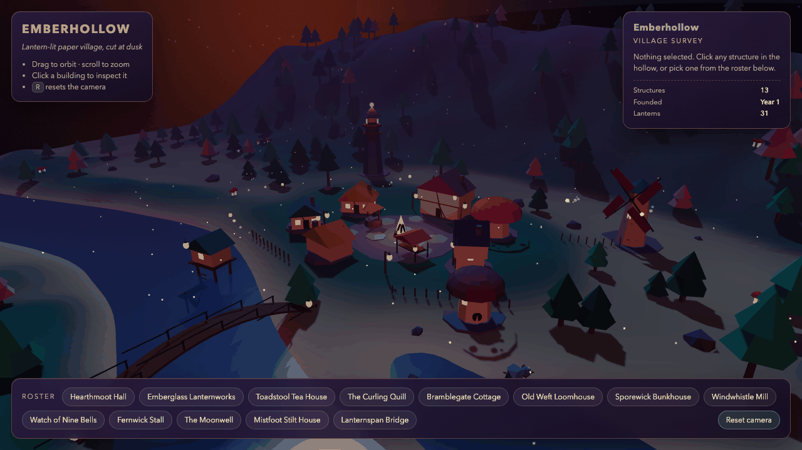 |  |  | 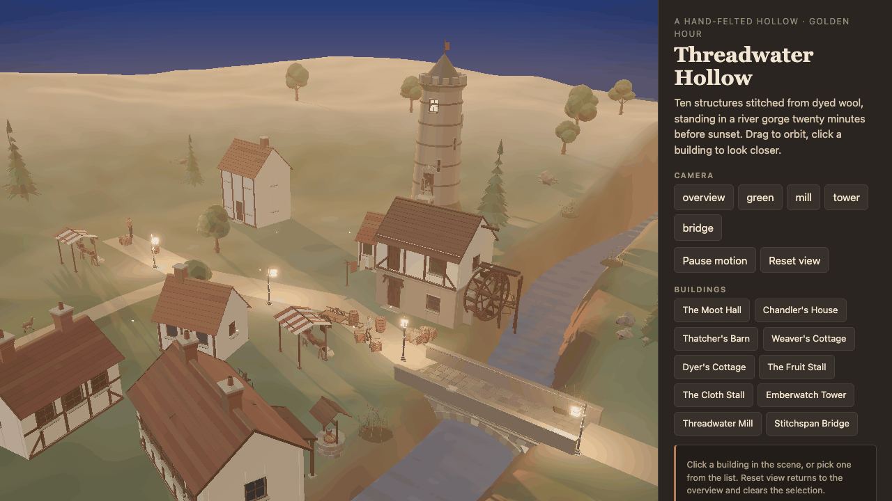 | 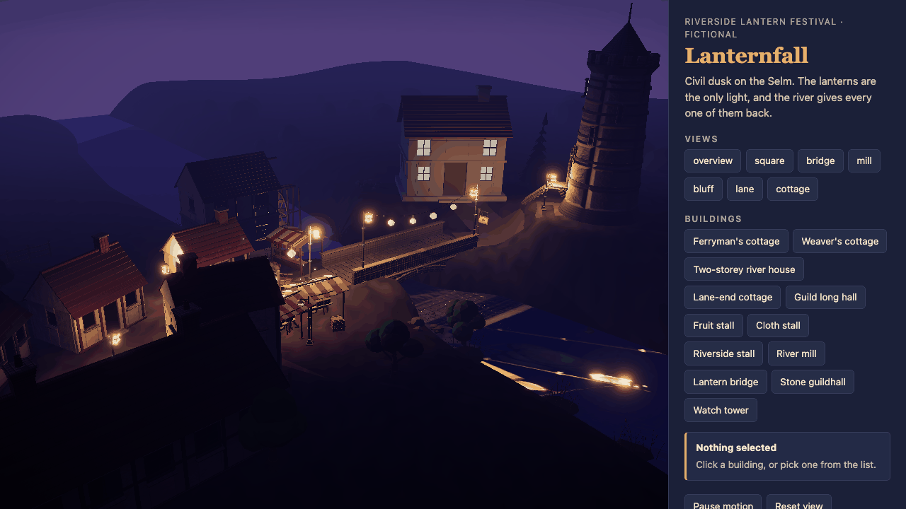 |
| Widest value range, most legible silhouettes; the bright horizon glow pulls the eye off the village. | Everything in one ochre band; canvas 928 px wide and the page 780 px tall in a 720 px window. | Committed darkness — readable only where a lantern reaches. Best palette discipline, least legible overview. | The most modelled scene of the four: figures, livestock, stalls, half-timbering, a working wheel. Also the haziest — the lit hills outrank the hero. | One cool family with warm practicals and their river reflections; the best-composed overview of the five. Its declared hero is almost invisible in it. |

### 2 · A selected building, at rest

All taken after the focus tween has settled, not mid-flight. The mill in runs 1–3 and the baseline;
run 4's declared hero is its cottage, so that is what it selects.

| without-skill | run 1 | run 2 | run 3 | run 4 |
| --- | --- | --- | --- | --- |
| 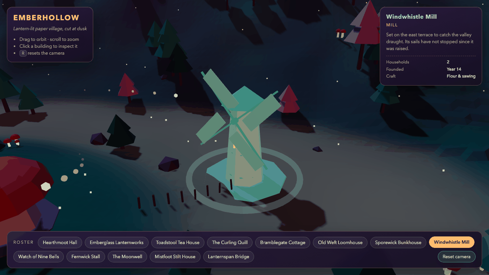 | 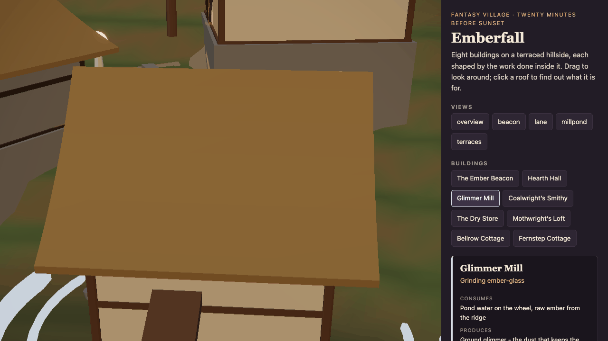 | 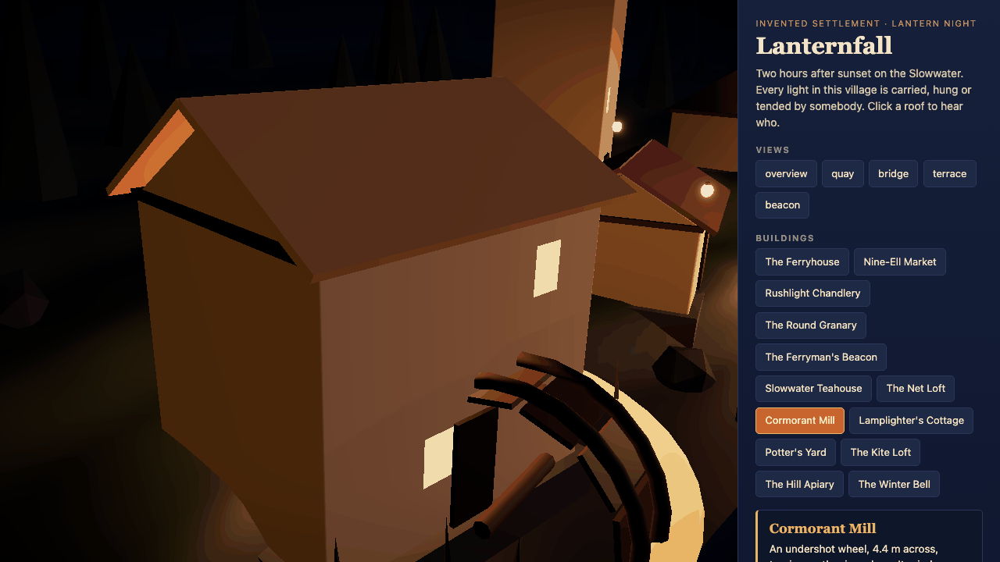 | 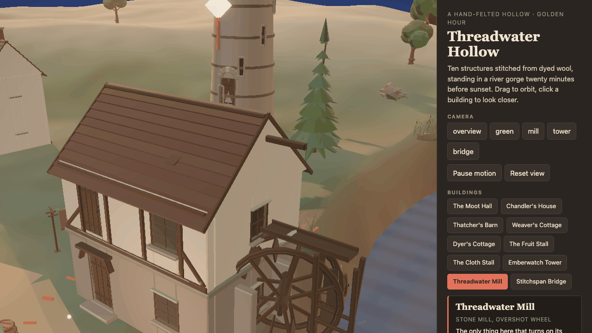 | 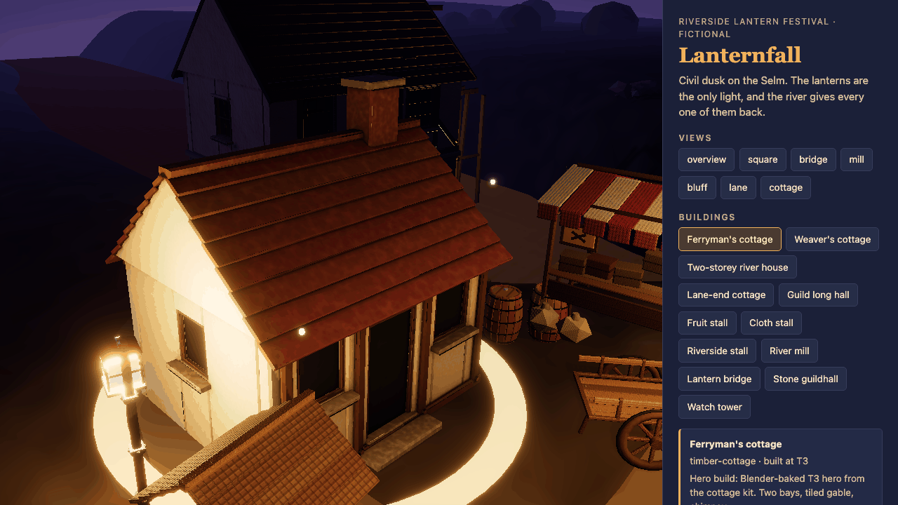 |
| Centred, legible, ground ring, `aria-pressed`. The jade repaint is heavy-handed but unambiguous. | Camera lands close above a roof; the mill is unreadable, no marker visible. | Better — silhouette and half the wheel read — but still too close and the wheel is cut. | **The framing defect is gone.** The whole building fits, the wheel and launder read, the tower gives context. | Also good: the whole cottage fits, the ring reads, and this is the frame the surface item is judged on because the run's own `cottage` close-up is blocked. |

After round 2 this row was the skill's clearest unfixed defect. Runs 3 and 4 both close it. Whether
that is the kit blueprints (which state their own approach distances) or a better draw of the dice at
n=1, this grading cannot say — but it has now held twice.

### 3 · Hero close-up — the detail ladder (item 16) and the surface (item 17)

Item 16 asks for at least two features in each of three bands — silhouette, medium, fine — on the
scene's declared hero. Item 17 asks the surfaces themselves to carry material texture and occlusion.
Counted on these frames.

| without-skill — Watch of Nine Bells | run 1 — The Ember Beacon | run 2 — The Ferryman's Beacon | run 3 — Threadwater Mill | run 4 — Ferryman's cottage (T3) |
| --- | --- | --- | --- | --- |
| 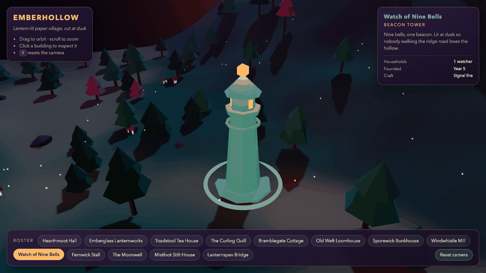 | 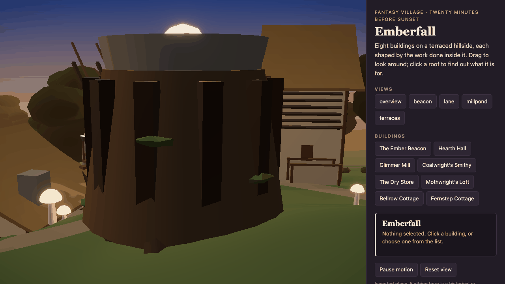 | 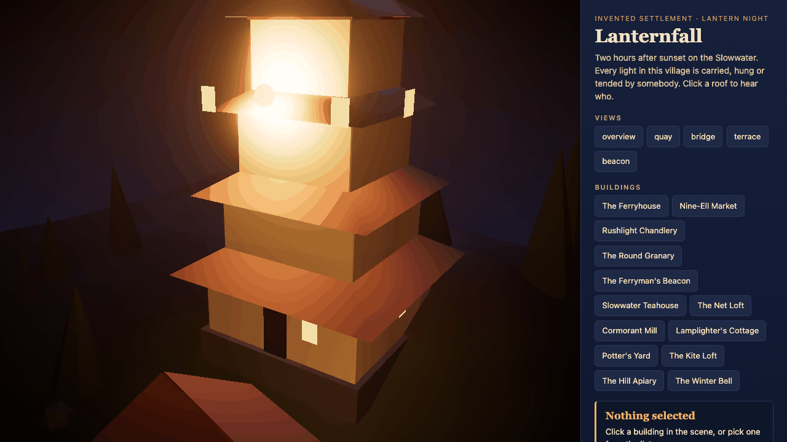 | 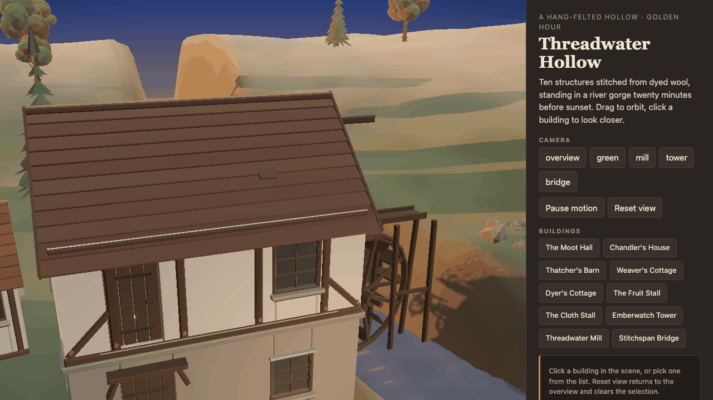 |  |
| silhouette 2 · medium 1–2 · **fine 0** — flat-shaded low-poly, no bevels or wear. **fail** | silhouette 2 · medium 3 · **fine 0** — an untextured near-black cone. **fail** | silhouette 2 · medium 3 · **fine 1** — and the bloom blowout destroys the top tier. **fail** | silhouette 3 · medium 5 · **fine 3** — sill drip strips, lapped roof courses, peg heads. **pass** on 16, **fail** on 17: relief without surface. | silhouette 3 · medium 5 · **fine 3**. **pass** on both — tile grain that varies course to course, and occlusion baked under the eaves, beside every timber and under each sill. The only item-17 pass in the evaluation. |

This is the sharpest discrimination in the whole evaluation, and it points at geometry and surface
rather than lighting or documentation: the first three runs build heroes that only read at 8 m, and
the first four build heroes made of flat albedo. Run 4's hero is the one object in the evaluation
that came out of a Blender bake rather than out of the browser.

### 4 · Liveness — the same frame, two seconds later

`capture.py --motion-check 2000 --expect-motion`, identical flags for all five. The baseline and runs
3 and 4 are not shown for space; all pass (`56e838b8…`→`7d0398d1…`, `40133c37…`→`7ac2e763…` and
`eeba3a8a…`→`6233c8ab…`).

| run | default | +2 s | result |
| --- | --- | --- | --- |
| run 1 |  | 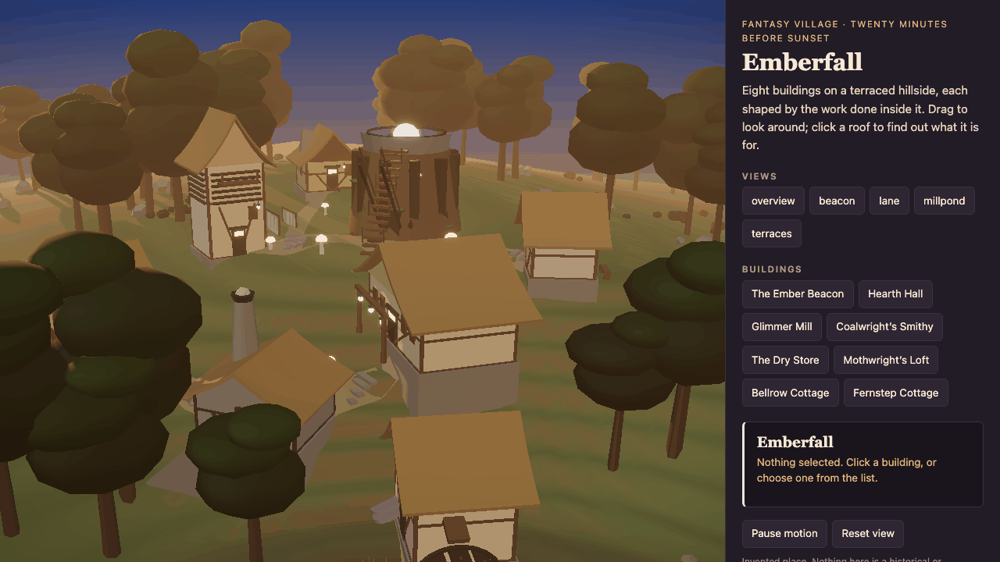 | **exit 5** — `differs: false`, both `f327200d1cac…`. Byte-identical. |
| run 2 |  | 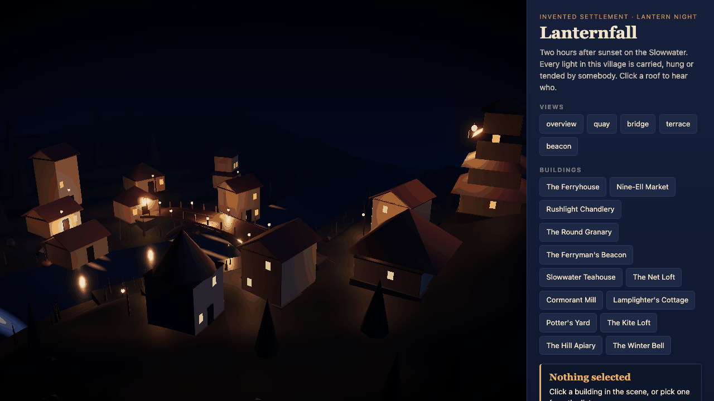 | exit 0 — `differs: true`. |

## Verdict

**Is run 4 better?** On the scorecard, by one item over run 3 and four over the baseline — and the
item it uniquely wins is again one that was added *because* earlier rounds failed it. On the
artifact it is the same shape of result as round 3: a real gain in one dimension, paid for
elsewhere.

- **Better:** the only run to pass the surface item, with a hero that is a Blender-baked T3 GLB
  rather than a browser-built approximation — verified by looking at the frame, not by reading its
  report. Viewport fit is back (720 px page, canvas 944×720), closing run 3's regression. Its
  documentation is the most complete of the five: a tier and a blueprint per object class, the host
  probe's ceiling and capture mode, a six-row departure table with a measured reason each, and two
  defects admitted in its own validation report before anyone graded it.
- **Worse:** **7,242 draw calls and 882 k triangles per drawn frame at 2.3 fps** under SwiftShader —
  the most expensive scene in the evaluation, 1.5× run 3 and 3.8× the baseline — and its report
  writes "not measured" for the cost while asserting "60 fps" elsewhere. Measured on the labelled GPU
  set, the truth is 46 fps, not 60.
- **Worse, and new:** **three of its seven named views are damaged by camera placement.** `lane` is
  a near-black frame from inside a building and `cottage`, the intended hero close-up, is blocked by
  a lantern post — both admitted. `square` is not admitted: a plaster wall at the near plane fills
  37.5 % of the canvas. A run that publishes seven views and can only use four has an inspection
  problem, and the per-frame checklist has no item that catches it.
- **Worse:** its declared hero is essentially invisible in the establishing frame — the selection
  ring is a 12 px sliver behind the market stalls.

**What the tiers bought.** Item 17 is the one measurable thing that changed between rounds 3 and 4,
and it changed in the direction the phase intended. But item 17 was written in the same week as the
tiers, by the same author, and a hero built from a shipped T3 GLB passes it close to by
construction — the item and the feature were designed together. Read it as "the tier machinery works
and the agent used it", not as evidence that the skill now makes better scenes.

**Is run 3 better?** On the scorecard, no: 23 each. It wins item 16, added *because* an earlier
round exposed that gap, and gives one back on the per-frame list for the viewport regression. (Before
item 9 gained its lightness floor it led by one, on a saturation pass that the floor now grants all
five runs.) On the artifact, it is a trade, not an advance over run 2:

- **Better:** the only run to pass the detail ladder (verified by counting features myself, not by
  reading its report), and the only frame of the five whose posterised bands all sit above item 9's
  lightness floor — it is the one run that would pass the saturation cap on any wording. The only
  with-skill run whose
  selection framing works. The most modelled scene — walking figures, livestock, market stalls,
  half-timbering, a working overshot wheel — and the cleanest look implementation, a single felt
  material pass rather than per-object styling.
- **Worse:** 4,773 draw calls per frame at 5.0 fps, seven times run 2's cost and 2.5× the baseline's,
  and its own report never notices. The layout regresses to run 1's failure — an 833 px page in a
  720 px window, so every capture is the top 720 px of a taller canvas and the mill's base is cut in
  its own named view.
- **Overclaims once:** its validation report asserts the mill's gable and the tower shaft read above
  the ground plane in grayscale. Measured, they do not — the hazy hills are at 158 mean luminance
  against the hero's 135. Item 4 fails for all four runs, but run 3 is the only one that says
  otherwise about itself.

**What the four with-skill runs show together.** 19 → 23 → 23 → 25 tracks the three skill changes
made between them, and all three were forced by this evaluation rather than found by the agents. The
liveness recovery in run 2 is attributable to the scaffold fix by code inspection: run 3 carries the
same clamped `elapsed = previous === null ? step : …` and the same `invalidate` wiring, and would
freeze without them. The detail ladder in run 3 is attributable to nothing so precisely — the kit
blueprints are the plausible cause, but a different agent drawing a different subject is an equally
good explanation at n=1.

**Where the baseline still wins, four rounds on.** It ships the only test suite of the five — no
with-skill run has written one, four times running. It is still the cheapest scene that does not
freeze (1,928 draw calls at 13.7 fps against run 4's 7,242 at 2.3). And it took 13 structures and
working canvas picking with no guidance at all. Its own measured failure — ignoring
`prefers-reduced-motion` — is real and none of the skill runs share it.

**Reading the scorecard honestly.** 21 / 19 / 23 / 23 / 25 out of 30 is a narrow band, and the
checklists increasingly reward what the skill teaches: three of the 30 items exist because of
failures found in this very evaluation or alongside the feature that passes them, and the with-skill
runs win all three. A grader who only read the totals would
conclude the skill helps by about 4 items out of 30. A grader who opened the frames would say
something narrower and more useful: the skill reliably buys documentation, provenance,
instrumentation, modelled detail since the kits and material surface since the tiers; it has **never
once bought performance** — the cost has risen in every with-skill round that added a feature, 687 →
4,773 → 7,242 — and it has now twice shipped a layout that does not fit the viewport and once shipped
three unusable views out of seven.

**Two follow-ups from this evaluation landed on 2026-09-09, after the five runs were generated and
without re-generating anything.** (1) Anti-slop item 9 now applies its 45 % saturation cap only to
pixels at HSL **L ≥ 0.2**, and to surfaces rather than sky or emissives: the old wording charged
night scenes for near-black pixels whose hue is numerically meaningless. Item 9 was re-read on the
five existing overview frames under the new wording and **all five now pass**, moving the totals from
20 / 18 / 22 / 23 / 24 to 21 / 19 / 23 / 23 / 25. Two verdicts change with it: runs 2 and 3 now tie
at 23 (run 3's one-item lead was that saturation pass), and run 4 leads run 3 by two items instead of
one. No other item was re-read, and no frame is less saturated than it was — the item stopped
charging pixels it could not measure. (2) `capture.py` now measures every capture (`view_quality` in
`capture-log.json`) and `--expect-usable` exits 6 on a view it flags. Run backwards over these five
runs' frames it flags exactly three: run 4's `lane` (near-black), `square` and `cottage` (a wall
filling the frame) — the three views this evaluation had to find by eye — and leaves the other 39
frames, including every overview, usable. It catches the wall in `cottage`, not the lantern post; no
mechanical check here would have caught that post.

## Limits

- **n = 1 per condition.** Five artifacts, one prompt, no repeats, no variance estimate. A one-item
  gap between runs 2 and 3, or between runs 3 and 4, is not a result.
- **Self-graded.** The grader is the same model family that generated all four artifacts. A second,
  independent grader is on the roadmap and has not happened.
- **The scale changed three times**, and each new item was added after a run failed it or alongside
  the feature that passes it. All five scorecards are on the 30-item scale, but run 3's agent could
  read items 15 and 16 while runs 1–2's could not, and only run 4's could read item 17 — the item
  that is also the only one it uniquely wins. **Item 17 and the T3 tier were authored in the same
  week by the same author**, so run 4's margin is the least independent result in the set.
- **Software renderer.** SwiftShader; every colour, bloom falloff and frame-rate number here is
  software-rasterised, not a GPU result.
- **Different self-inspection tools** across rounds, each round's including the check the previous
  round failed. Run 4 additionally had `host-probe.py` and the quality brief, which no earlier run
  had.
- **Run 4 inspected itself on a GPU** and was graded on SwiftShader. Its own fix decisions were
  therefore made from frames that are not the frames scored here; the labelled GPU set is published
  so the difference can be seen.
- **Asymmetric capture coverage** — five named views for the skill runs, one default view plus clicks
  for the baseline. Only `captures-uniform/` is method-identical.
- **Toggle tests were not run.** Light-removal, fog on/off, emissive-off and near-plane zoom are
  marked `n-a` for all four, never `pass`.
- **Item 9's wording changed after the runs were generated.** All five were re-read under the
  lightness floor on the frames they were already graded on, and all five pass it now — so item 9
  no longer separates any pair of runs, and the four totals that moved moved by exactly one each.
  A rule the evaluation itself forced, applied to the evaluation that forced it.

## Follow-up

The frozen scene in round 1 was traced to the skill's own scaffold: the demand loop in
`templates/scaffold-vite-threejs/main.js` charged the first frame after idle `dt = 0`, and
`createCameraRig` was never handed an `invalidate`. Both were fixed on 2026-09-08, and
`scripts/capture.py` gained `--motion-check MS` / `--expect-motion` (exit 5 when two frames are
identical) with a matching liveness item in both checklists. `visual-anti-slop.md` later gained item
16, the detail ladder, and on 2026-09-09 item 17, surface on the hero, when the kit quality tiers
(T0–T4) landed. **Run 1's artifact, captures and numbers are unchanged** — it is the run as it
happened, re-scored but not re-generated.

Open after round 4:

- **Draw-call cost is unmanaged and still rising** (687 → 4,773 → 7,242 across runs 2, 3 and 4).
  Nothing in the workflow or the checklists asks an agent to look at it. Run 3's report did not
  mention it; run 4's wrote "not measured" and asserted 60 fps without reading a counter. Every
  feature added so far — kits, then tiers — has cost frames.
- ~~**Nothing checks that a named view is usable.**~~ **Closed 2026-09-09.** `capture.py` now
  measures every capture (`view_quality`: luma mean/std, dark fraction, flat and wall fractions,
  and a `usable`/`reason` verdict) and `--expect-usable` exits 6 on a flagged view; the per-frame
  checklist asks the grader to read it. Run backwards over these five runs, it flags run 4's
  `lane`, `square` and `cottage` and nothing else in 42 frames. The lantern post in `cottage` is
  still not what it catches — the wall behind the post is.
- **Viewport fit is unreliable** — failed in runs 1 and 3, passed in runs 2 and 4, with no guidance
  covering it.
- **No with-skill run has written a test.** The baseline has, all four times.
- ~~**Item 9 needs a lightness floor**~~ **Closed 2026-09-09**: the cap applies at L ≥ 0.2 and to
  surfaces, and all five runs were re-read under it. What remains open is that the item now has
  nothing to say about a night scene whose every posterised band sits below the floor (run 2), which
  is a pass by absence of measurable surface rather than by restraint.
- **Hero contrast (item 4) has never passed**, in any of the five runs. Run 4 makes the reason
  concrete: its hero is occluded in its own establishing frame.
- **A second, independent grader is still owed.** Run 4's only unique win is on an item written in
  the same week as the feature that passes it, by the same author, and graded by the same model
  family that generated it.

## Contents

```
prompt.txt                     the canonical prompt, verbatim
run.json                       protocol, runs, capture commands, instrumentation, limits
without-skill/                 baseline
with-skill/                    round 1, pre-fix
with-skill-run2/               round 2, post-fix
with-skill-run3/               round 3, kit steps
with-skill-run4/               round 4, quality tiers
  src/                         the generated project, minus installed dependencies and the build
                               output; run 4 also omits the four .glb binaries under
                               src/kits/gltf/, which are byte-identical copies of the skill's
                               (sha256-verified) - see the note file in that folder
  captures/                    named views, click frames, default-motion, capture-log.json
                               (SwiftShader; the scored set)
  captures-uniform/            the method-identical default + 2 s pair used for liveness
  captures-gpu/                run 4 only: the same views on ANGLE Metal. Extra, labelled,
                               NOT scored - published so the software/GPU difference is visible
  checklist.md                 every checklist item, pass/fail/n-a, with evidence
```
